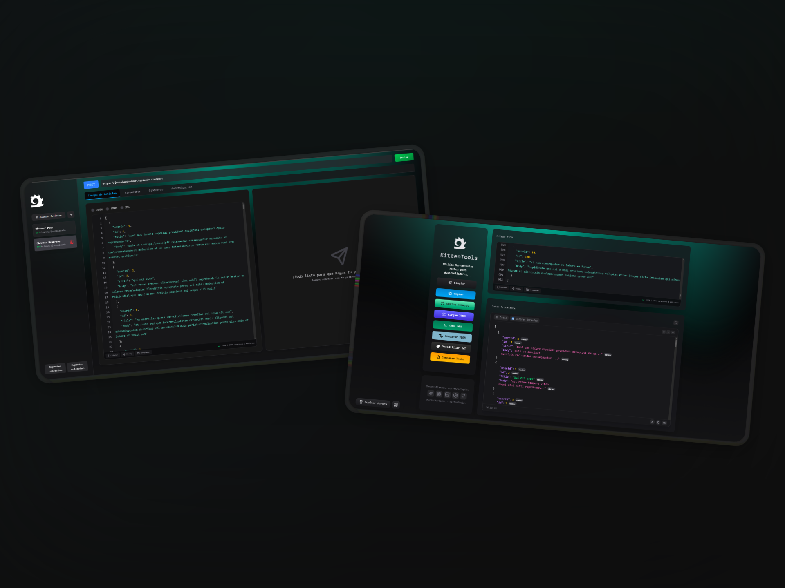

# 
Jade 💎 

**Jade** es una herramienta sencilla pero poderosa diseñada para:

- Formatear JSON de forma clara y legible.
- Generar **interfaces de TypeScript** al instante.
- Decodificar **JSON Web Tokens** (JWT).
- Comparar JSON y texto.
- Generar tablas dinámicas.
- Crear tipados en TypeScript.
  
Todo **sin necesidad de conectarse a un backend** ni realizar consumos externos.

Bajo la filosofía **"lo que es del frontend, se queda en el frontend"**, **ReactMatter** apuesta por la eficiencia, rapidez y simplicidad.

## 🚀 ¿Qué ofrece ReactMatter?

- ✨ **Formateo de JSON** con estilos modernos y fácil lectura.
- ⚙️ **Generación automática** de interfaces TypeScript basadas en el JSON ingresado.
- 🧠 **Interfaz intuitiva**, pensada para la experiencia del desarrollador.
- 📦 **Carga de archivos JSON** *(en desarrollo)*.

---

💡 **Ideal para** desarrolladores que trabajan con APIs, mockups o estructuras de datos complejas.

> Construido con **React**, su nombre refleja la unión de potencia y practicidad: React + herramientas que realmente importan.
